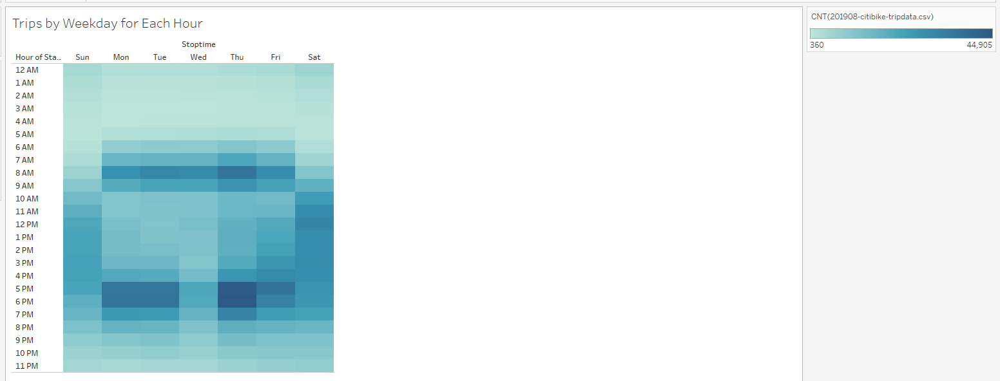

# NYC Bike Sharing Analysis

## 1 Purpose

Kate and I were on a vacation in New York City and used a bike share program to get around.  We both liked it so much that we wanted to set up a similar program in Des Moines where Kate is from.  I need to rely on Kate's salesmanship during the investor conversations since she is a great spokes person but she suggests that I used available Citi Bike data that has been released to the public and conducted an analysis.  I reminded her that we must be cautious when looking at the data, as it applies specifically to New York City—Des Moines is quite different!  Kate has arranged for us to pitch some key seed investors but I need to solidify the proposal, one of the key stakeholders would like to see a bike trip analysis.

## 2 Results

Using Python and Pandas functions I converted the "tripduration" column from an integer to a datetime datatype to get the time in hours, minutes, and seconds (00:00:00).  This conversion gives us some interesting analysis capabilities for our presentation.  After converting the "tripduration" column to a datetime dataytpe, I exported the DataFrame as a CSV file to use for my trip analysis.

Using Tableau, I created visualizations that show:

- How long bikes are checked out for all riders and genders.
- How many trips are taken by the hour for each day of the week, for all riders and genders.
- A breakdown of what days of the week a user might be more likely to check out a bike, by type of user and gender.

### 2.1: Change Trip Duration to a Datetime Format

The change trip duration to datetime format I first read in the original citibike data csv file into a Pandas dataframe using the Pandas read_csv function, as in the code fence below.

```python
# 1. Create a DataFrame for the 201908-citibike-tripdata data. 
# File to load
citibike_data_to_load = os.path.join("Resources/original", "201908-citibike-tripdata.csv")
# Read the school data file and store it in a Pandas DataFrame.
citibike_data_df = pd.read_csv(citibike_data_to_load)
```

Next the data in the "tripduration" column is converted to the correct format using the Pandas to_datetime function, see code fence below. 

```python
# 3. Convert the 'tripduration' column to datetime datatype.
citibike_data_df['tripduration'] = pd.to_datetime(citibike_data_df['tripduration'], unit='s')
```

In the code fence below you can see that the converted dataframe was then exported as a new file without the index using the to_csv function.

- The DataFrame is exported as a new file without the index column **(5 pt)**

```python
# 5. Export the Dataframe as a new CSV file without the index.
# Create the output file (CSV).
output_data_file = os.path.join("Resources", "201908-citibike-tripdata.csv")
# Export the City_Data into a CSV.
citibike_data_df.to_csv(output_data_file,index=False)
```


### 2.2: Create Visualizations for the Trip Analysis

In figure 1 below, you will see a line graph displaying the number of bikes checked out by duration for all users, and the graph can be filtered by the hour.   Setting the Tripduration column to datetime format was necessary to allow Tableau to be able to provide this view.


***Figure 1 - Checkout Times for Users***


In figure number 2 below is the same line graph displaying the number of bikes that are checked out by duration for each gender by the hour, however, it  can now also be filtered by the hour and gender. 


***Figure 2 - Checkout Times by Gender***


I created a heatmap in figure 3, showing the number of bike trips for each hour of each day of the week.  The scale to the right indicates that the lightest colour represents 360 trips and the darkest 44,905. 



***Figure 3 - Trips by Weekday for Each Hour***


In figure 4 you will find a heatmap I created showing the number of bike trips, by gender, for each hour of each day of the week as in figure 3, however this heatmap can also be filtered by gender. 


***Figure 4 - Trips by Gender Weekday per Hour***


Figure 5 shows a heatmap indicating the number of bike trips for each type of user and gender for each day of the week, and you can also filter by user type and gender.


***Figure 5 - User Trips by Gender by Weekday***


You can see in figure 6 below that the starting and ending location for bike sharing are very similar, leading me to believe that some rides are circular and others are commuters with few one way bike rides.


***Figure 6 - Comparison of Staring and Ending Locations***

An interesting outcome for having converted the duration field to datetime was on one hand, there were other features available, but on the other hand it no longer was directly useful for measurements.  In order to make use of measurement type data I ended up calculating my own duration using the starttime and stoptime columns.  Figure 7 below is a screenshot of the calculation that I used to create a "Calculated Trip Duration" measure.


***Figure 7 - Tableau Created Calculated Trip Duration Measure***


The total bike utilization and the average trip duration are now able to be displayed using the new "Calculated Trip Duration" measure as show in figure 8 below.


***Figure 8 - Calculated Duration Visualizations***


## 3 Summary

Kate now has a good overview of the citibike share program in New York City, she could however, think of adding the following additional information to help with her pitch.

- A good additional visualization would be to see if, by user, how many rides are circular (i.e. the starting and ending point are the same)  and how many are linear.  This would help us determine the nature of the bike ride, for example, is the ride for pleasure or with a purpose with a destination in mind.
- One other visualization that would be useful would be to get data for other months to see how they vary.  I suspect that August may not actually be the most active month for bike riding as it is very hot.  If Kate is to make a business case for investor we need to know how many months we can operate and what is the total expected utilization.

The full story of the NYC CitiBike Analysis program can be found at this link.

https://public.tableau.com/app/profile/greg.wilson8781/viz/NYC_CitiBike_Analysis_16449607201540/Story?publish=yes
